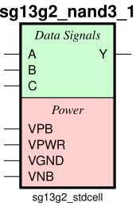
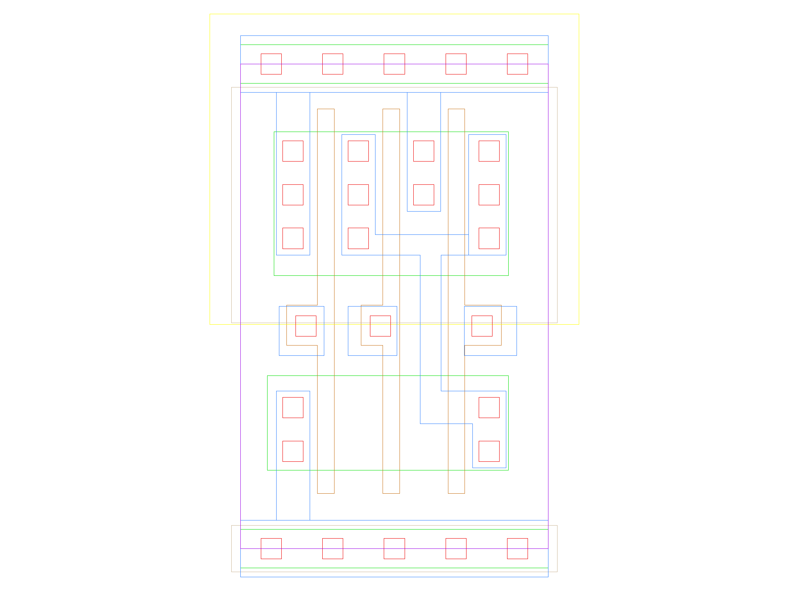

sg13g2_nand3_1
==============

3-input NAND

-  **Cell name**: sg13g2_nand3_1
-  **Type**: cell
-  **Verilog name**: sg13g2_nand3_1
-  **Library**: sg13g2_stdcell
-  **Inputs**:  3 (A, B, C)
-  **Outputs**: 1 (Y)

Electrical and Physical Data
----------------------------

-  **Area**: 9.072 µm²
-  **Pin Capacitance**:

   .. list-table::
      :widths: 50 50
      :header-rows: 1

      * - Pin
        - Capacitance (pF)
      * - A
        - 0.00287977
      * - B
        - 0.00300949
      * - C
        - 0.00297917
      * - Y
        - 0.001

sg13g2_nand3_1 symbol
---------------------

    sg13g2_nand3_1 symbol

sg13g2_nand3_1 schematic
------------------------

    sg13g2_nand3_1 schematic

sg13g2_nand3_1 GDSII layouts
-----------------------------

    sg13g2_nand3_1 layout
