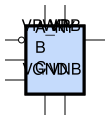
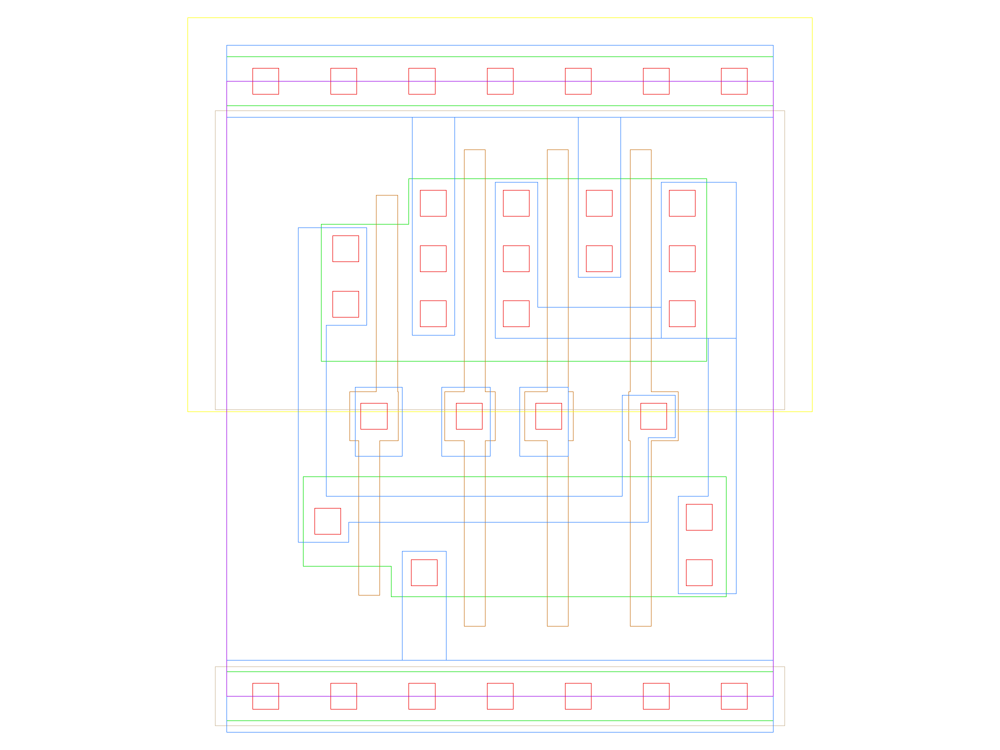

sg13g2_nand3b
=============

3-input NAND3 with Inverted Input A_N

-  **Group name**: sg13g2_nand3b
-  **Type**: cell
-  **Library**: sg13g2_stdcell
-  **Inputs**:  3 (A_N, B, C)
-  **Outputs**: 1 (Y)

sg13g2_nand3b symbols
---------------------

    sg13g2_nand3b symbol

sg13g2_nand3b schematic
-----------------------

    sg13g2_nand3b schematic

sg13g2_nand3b GDSII layouts
----------------------------

sg13g2_nand3b_1
~~~~~~~~~~~~~~~

-  **Area**: 12.7008 µm²
-  **Pin Capacitance**:

   .. list-table::
      :widths: 50 50
      :header-rows: 1

      * - Pin
        - Capacitance (pF)
      * - A_N
        - 0.00222256
      * - B
        - 0.00297309
      * - C
        - 0.00298984
      * - Y
        - 0.001

    sg13g2_nand3b_1 layout
