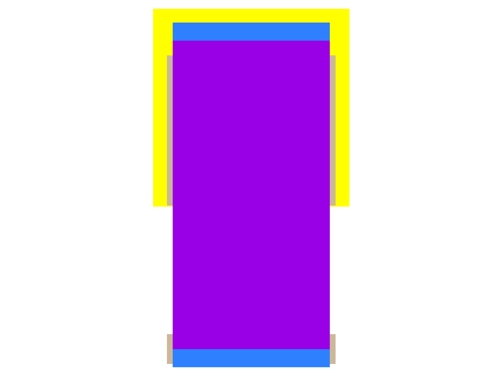
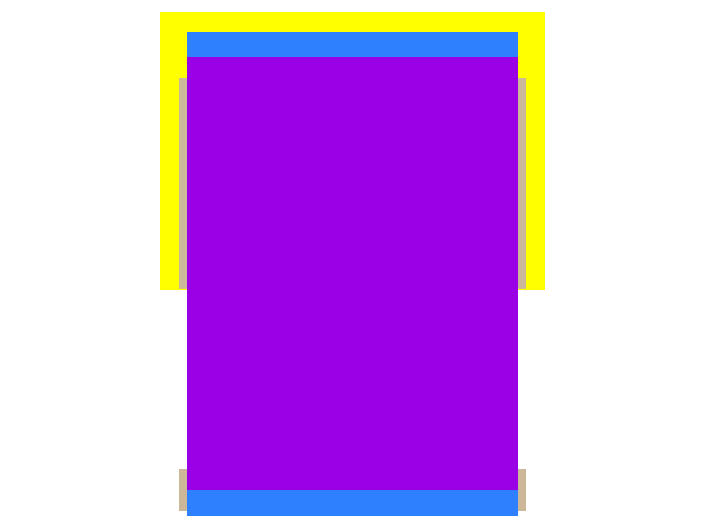

sg13g2_nor2
===========

2-input NOR

-  **Group name**: sg13g2_nor2
-  **Type**: cell
-  **Library**: sg13g2_stdcell
-  **Inputs**:  2 (A, B)
-  **Outputs**: 1 (Y)

sg13g2_nor2 symbols
-------------------

.. figure:: ../../../_static/symbols/sg13g2_nor2_1.svg
    :align: center
    :width: 60%

    sg13g2_nor2 symbol

sg13g2_nor2 schematic
---------------------

    sg13g2_nor2 schematic

sg13g2_nor2 GDSII layouts
--------------------------

sg13g2_nor2_1
~~~~~~~~~~~~~

-  **Area**: 7.2576 µm²
-  **Pin Capacitance**:

   .. list-table::
      :widths: 50 50
      :header-rows: 1

      * - Pin
        - Capacitance (pF)
      * - A
        - 0.00304068
      * - B
        - 0.00291906
      * - Y
        - 0.001

    sg13g2_nor2_1 layout

sg13g2_nor2_2
~~~~~~~~~~~~~

-  **Area**: 10.8864 µm²
-  **Pin Capacitance**:

   .. list-table::
      :widths: 50 50
      :header-rows: 1

      * - Pin
        - Capacitance (pF)
      * - A
        - 0.00580332
      * - B
        - 0.00560432
      * - Y
        - 0.001

    sg13g2_nor2_2 layout
