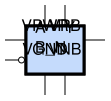
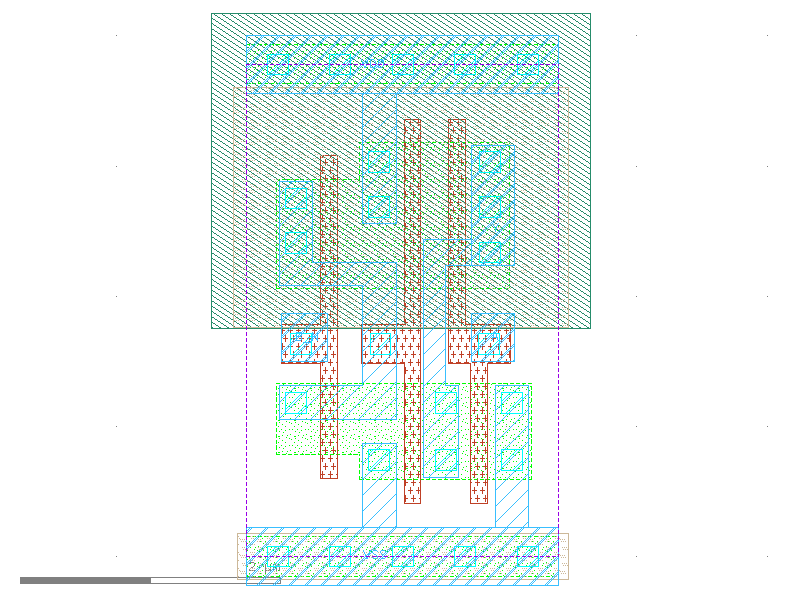

sg13g2_nor2b
============

2-input NOR2 with Inverted Input B_N

-  **Group name**: sg13g2_nor2b
-  **Type**: cell
-  **Library**: sg13g2_stdcell
-  **Inputs**:  2 (A, B_N)
-  **Outputs**: 1 (Y)

sg13g2_nor2b symbols
--------------------

    sg13g2_nor2b symbol

sg13g2_nor2b schematic
----------------------

    sg13g2_nor2b schematic

sg13g2_nor2b GDSII layouts
---------------------------

sg13g2_nor2b_1
~~~~~~~~~~~~~~

-  **Area**: 9.072 µm²
-  **Pin Capacitance**:

   .. list-table::
      :widths: 50 50
      :header-rows: 1

      * - Pin
        - Capacitance (pF)
      * - A
        - 0.00292348
      * - B_N
        - 0.00226593
      * - Y
        - 0.001

    sg13g2_nor2b_1 layout

sg13g2_nor2b_2
~~~~~~~~~~~~~~

-  **Area**: 12.7008 µm²
-  **Pin Capacitance**:

   .. list-table::
      :widths: 50 50
      :header-rows: 1

      * - Pin
        - Capacitance (pF)
      * - A
        - 0.00567165
      * - B_N
        - 0.00268047
      * - Y
        - 0.001

.. figure:: ../../../_static/images/sg13g2_nor2b_2.png
    :align: center
    :width: 80%

    sg13g2_nor2b_2 layout
