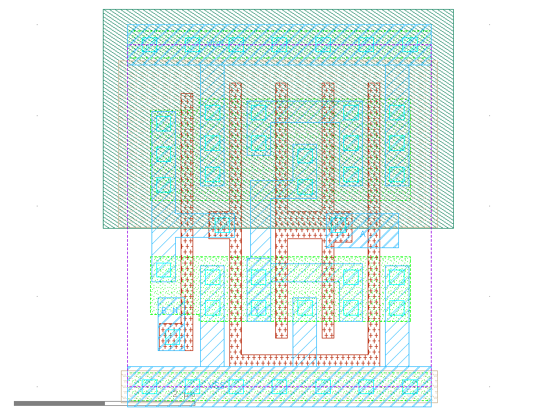

sg13g2_nor2b_2
==============

2-input NOR2 with Inverted Input B_N

-  **Cell name**: sg13g2_nor2b_2
-  **Type**: cell
-  **Verilog name**: sg13g2_nor2b_2
-  **Library**: sg13g2_stdcell
-  **Inputs**:  2 (A, B_N)
-  **Outputs**: 1 (Y)

sg13g2_nor2b_2 GDSII layouts
-----------------------------

    sg13g2_nor2b_2
