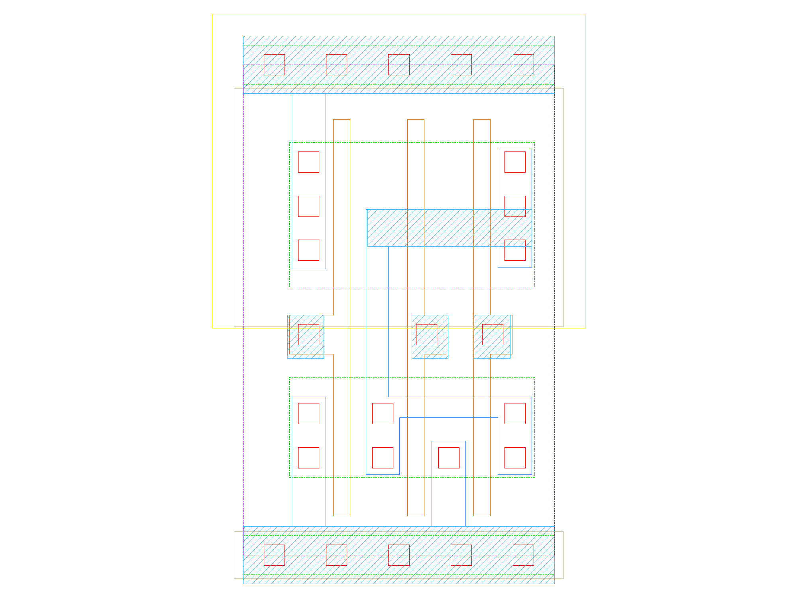

sg13g2_nor3
===========

3-input NOR

-  **Group name**: sg13g2_nor3
-  **Type**: cell
-  **Library**: sg13g2_stdcell
-  **Inputs**:  3 (A, B, C)
-  **Outputs**: 1 (Y)

sg13g2_nor3 symbols
-------------------

.. figure:: ../../../_static/symbols/sg13g2_nor3_1.svg
    :align: center
    :width: 60%

    sg13g2_nor3 symbol

sg13g2_nor3 schematic
---------------------

    sg13g2_nor3 schematic

sg13g2_nor3 GDSII layouts
--------------------------

sg13g2_nor3_1
~~~~~~~~~~~~~

-  **Area**: 9.072 µm²
-  **Pin Capacitance**:

   .. list-table::
      :widths: 50 50
      :header-rows: 1

      * - Pin
        - Capacitance (pF)
      * - A
        - 0.00301098
      * - B
        - 0.00302226
      * - C
        - 0.00289876
      * - Y
        - 0.001

    sg13g2_nor3_1 layout

sg13g2_nor3_2
~~~~~~~~~~~~~

-  **Area**: 16.3296 µm²
-  **Pin Capacitance**:

   .. list-table::
      :widths: 50 50
      :header-rows: 1

      * - Pin
        - Capacitance (pF)
      * - A
        - 0.00575969
      * - B
        - 0.0057518
      * - C
        - 0.00557185
      * - Y
        - 0.001

.. figure:: ../../../_static/images/sg13g2_nor3_2.png
    :align: center
    :width: 80%

    sg13g2_nor3_2 layout
