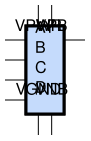
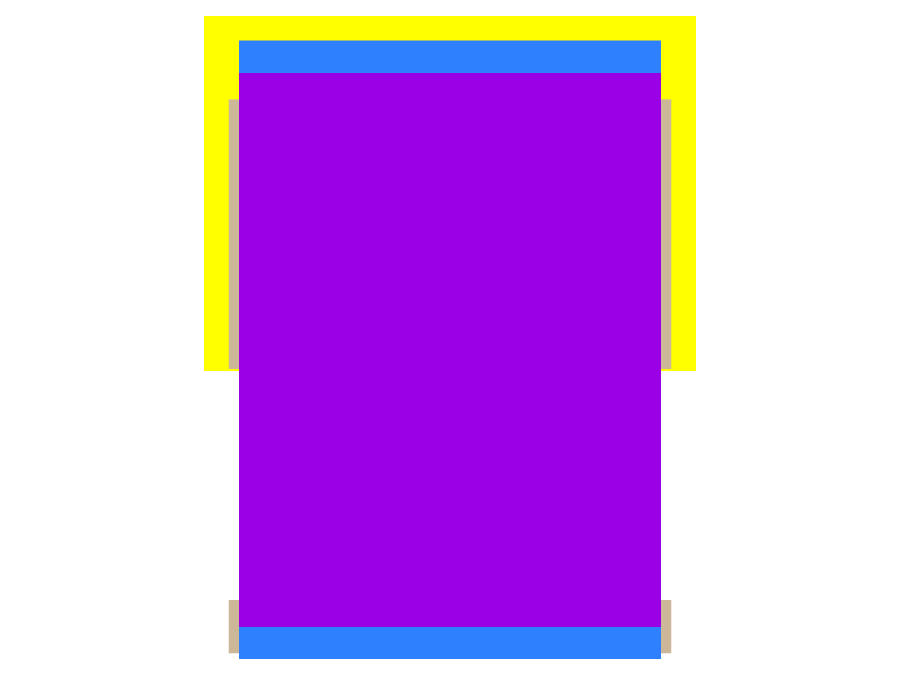

sg13g2_nor4
===========

4-input NOR

-  **Group name**: sg13g2_nor4
-  **Type**: cell
-  **Library**: sg13g2_stdcell
-  **Inputs**:  4 (A, B, C, D)
-  **Outputs**: 1 (Y)

sg13g2_nor4 symbols
-------------------

    sg13g2_nor4 symbol

sg13g2_nor4 schematic
---------------------

    sg13g2_nor4 schematic

sg13g2_nor4 GDSII layouts
--------------------------

sg13g2_nor4_1
~~~~~~~~~~~~~

-  **Area**: 10.8864 µm²
-  **Pin Capacitance**:

   .. list-table::
      :widths: 50 50
      :header-rows: 1

      * - Pin
        - Capacitance (pF)
      * - A
        - 0.00298675
      * - B
        - 0.003003
      * - C
        - 0.00297233
      * - D
        - 0.00283259
      * - Y
        - 0.001

    sg13g2_nor4_1 layout

sg13g2_nor4_2
~~~~~~~~~~~~~

-  **Area**: 21.7728 µm²
-  **Pin Capacitance**:

   .. list-table::
      :widths: 50 50
      :header-rows: 1

      * - Pin
        - Capacitance (pF)
      * - A
        - 0.00576178
      * - B
        - 0.00571722
      * - C
        - 0.00567206
      * - D
        - 0.00553401
      * - Y
        - 0.001

.. figure:: ../../../_static/images/sg13g2_nor4_2.png
    :align: center
    :width: 80%

    sg13g2_nor4_2 layout
