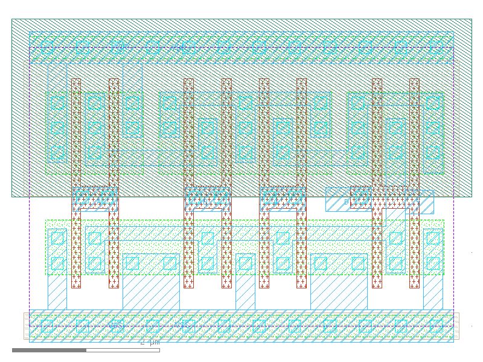

sg13g2_nor4_2
=============

**nor4**

-  **Cell name**: sg13g2_nor4_2
-  **Type**: cell
-  **Verilog name**: sg13g2_nor4_2
-  **Library**: sg13g2_stdcell
-  **Inputs**:  4 (A, B, C, D)
-  **Outputs**: 1 (Y)

sg13g2_nor4_2 GDSII layouts
----------------------------

    sg13g2_nor4_2
