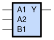
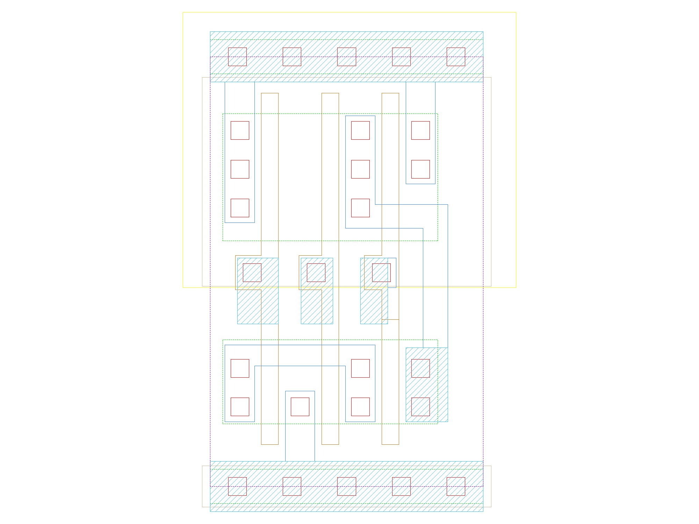

sg13g2_o21ai
============

2-input OR into 2-input NAND

-  **Group name**: sg13g2_o21ai
-  **Type**: cell
-  **Library**: sg13g2_stdcell
-  **Inputs**:  3 (A1, A2, B1)
-  **Outputs**: 1 (Y)

sg13g2_o21ai symbols
--------------------

    sg13g2_o21ai symbol

sg13g2_o21ai schematic
----------------------

    sg13g2_o21ai schematic

sg13g2_o21ai GDSII layouts
---------------------------

sg13g2_o21ai_1
~~~~~~~~~~~~~~

-  **Area**: 9.072 µm²
-  **Pin Capacitance**:

   .. list-table::
      :widths: 50 50
      :header-rows: 1

      * - Pin
        - Capacitance (pF)
      * - A1
        - 0.00337156
      * - A2
        - 0.00334058
      * - B1
        - 0.00320965
      * - Y
        - 0.001

    sg13g2_o21ai_1 layout
