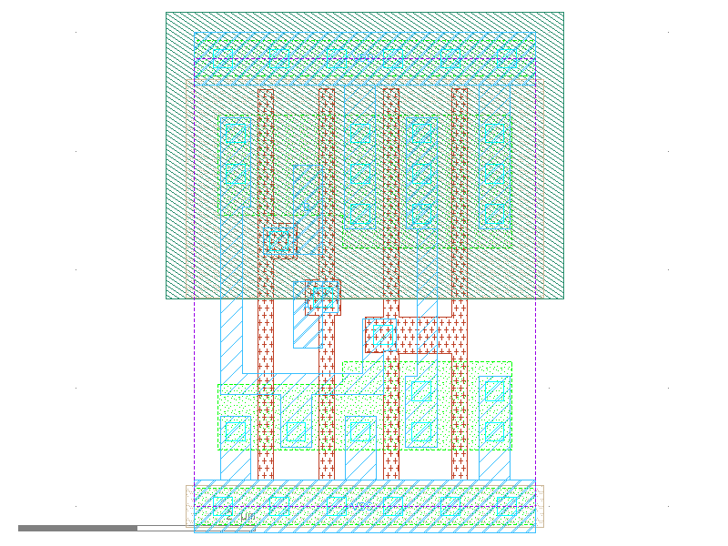

sg13g2_or2
==========

2-input OR

-  **Group name**: sg13g2_or2
-  **Type**: cell
-  **Library**: sg13g2_stdcell
-  **Inputs**:  2 (A, B)
-  **Outputs**: 1 (X)

sg13g2_or2 symbols
------------------

.. figure:: ../../../_static/symbols/sg13g2_or2_1.svg
    :align: center
    :width: 60%

    sg13g2_or2 symbol

sg13g2_or2 schematic
--------------------

.. figure:: ../../../_static/schematics/sg13g2_or2_1.svg
    :align: center
    :width: 80%

    sg13g2_or2 schematic

sg13g2_or2 GDSII layouts
-------------------------

sg13g2_or2_1
~~~~~~~~~~~~

-  **Area**: 9.072 µm²
-  **Pin Capacitance**:

   .. list-table::
      :widths: 50 50
      :header-rows: 1

      * - Pin
        - Capacitance (pF)
      * - A
        - 0.00246875
      * - B
        - 0.00229712
      * - X
        - 0.001

.. figure:: ../../../_static/images/sg13g2_or2_1.png
    :align: center
    :width: 80%

    sg13g2_or2_1 layout

sg13g2_or2_2
~~~~~~~~~~~~

-  **Area**: 10.8864 µm²
-  **Pin Capacitance**:

   .. list-table::
      :widths: 50 50
      :header-rows: 1

      * - Pin
        - Capacitance (pF)
      * - A
        - 0.00245609
      * - B
        - 0.00228363
      * - X
        - 0.001

    sg13g2_or2_2 layout
