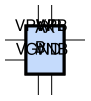
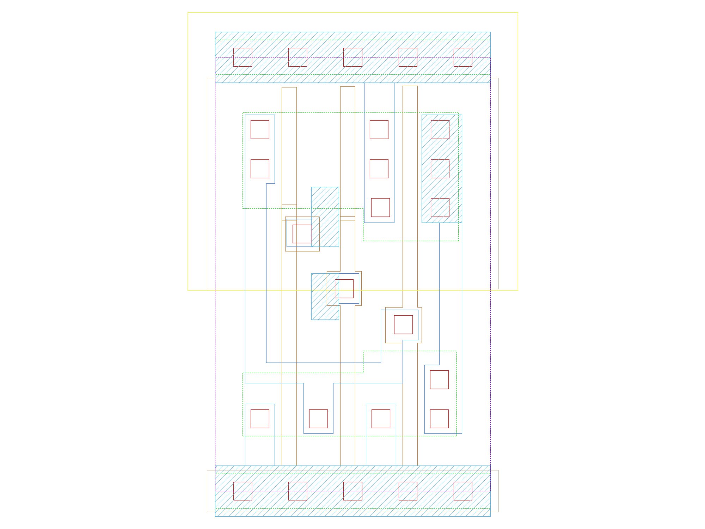

sg13g2_or2_1
============

2-input OR

-  **Cell name**: sg13g2_or2_1
-  **Type**: cell
-  **Verilog name**: sg13g2_or2_1
-  **Library**: sg13g2_stdcell
-  **Inputs**:  2 (A, B)
-  **Outputs**: 1 (X)

sg13g2_or2_1 symbol
-------------------

    sg13g2_or2_1 symbol

sg13g2_or2_1 schematic
----------------------

    sg13g2_or2_1 schematic

sg13g2_or2_1 GDSII layouts
---------------------------

    sg13g2_or2_1 layout
