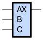
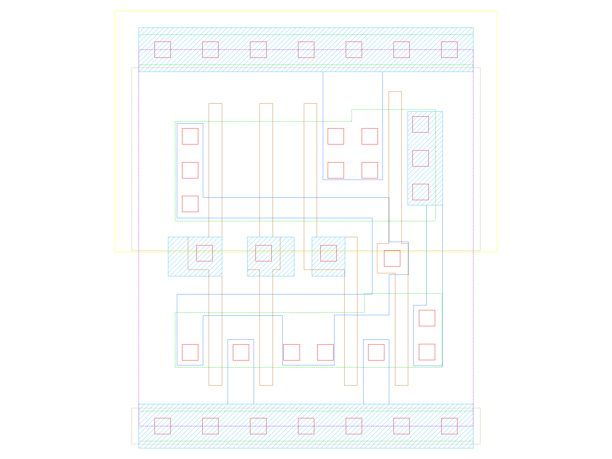
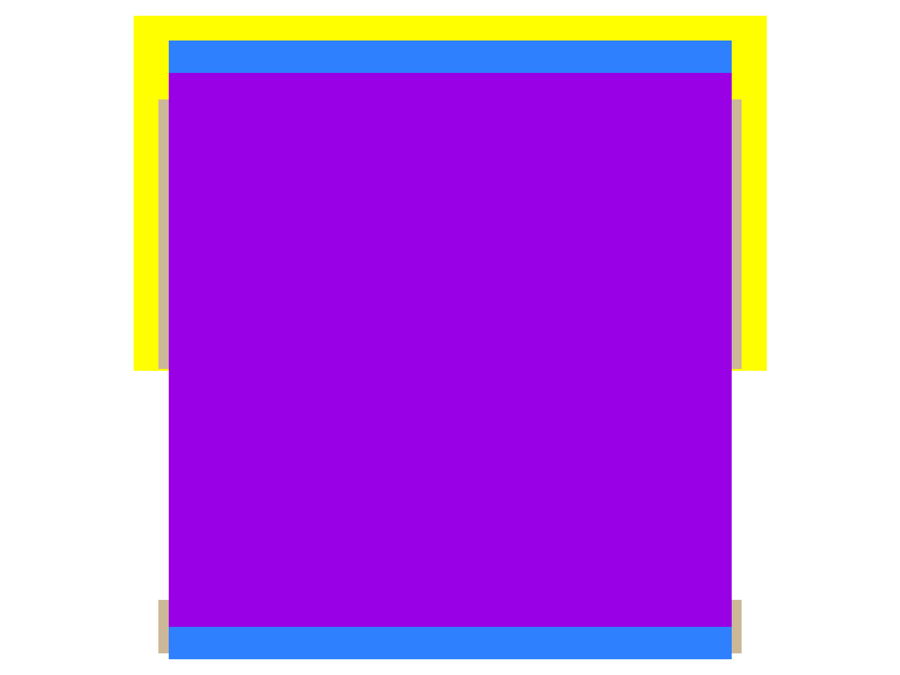

sg13g2_or3
==========

3-input OR

-  **Group name**: sg13g2_or3
-  **Type**: cell
-  **Library**: sg13g2_stdcell
-  **Inputs**:  3 (A, B, C)
-  **Outputs**: 1 (X)

sg13g2_or3 symbols
------------------

    sg13g2_or3 symbol

sg13g2_or3 schematic
--------------------

    sg13g2_or3 schematic

sg13g2_or3 GDSII layouts
-------------------------

sg13g2_or3_1
~~~~~~~~~~~~

-  **Area**: 12.7008 µm²
-  **Pin Capacitance**:

   .. list-table::
      :widths: 50 50
      :header-rows: 1

      * - Pin
        - Capacitance (pF)
      * - A
        - 0.00259423
      * - B
        - 0.00252763
      * - C
        - 0.00240308
      * - X
        - 0.001

    sg13g2_or3_1 layout

sg13g2_or3_2
~~~~~~~~~~~~

-  **Area**: 14.5152 µm²
-  **Pin Capacitance**:

   .. list-table::
      :widths: 50 50
      :header-rows: 1

      * - Pin
        - Capacitance (pF)
      * - A
        - 0.00258569
      * - B
        - 0.00252154
      * - C
        - 0.00239671
      * - X
        - 0.001

    sg13g2_or3_2 layout
