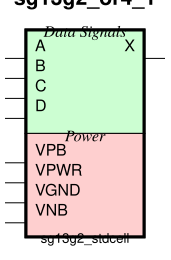

sg13g2_or4
==========

4-input OR

-  **Group name**: sg13g2_or4
-  **Type**: cell
-  **Library**: sg13g2_stdcell
-  **Inputs**:  4 (A, B, C, D)
-  **Outputs**: 1 (X)

sg13g2_or4 symbols
------------------

    sg13g2_or4 symbol

sg13g2_or4 schematic
--------------------

.. figure:: ../../../_static/schematics/sg13g2_or4_1.svg
    :align: center
    :width: 80%

    sg13g2_or4 schematic

sg13g2_or4 GDSII layouts
-------------------------

sg13g2_or4_1
~~~~~~~~~~~~

-  **Area**: 14.5152 µm²
-  **Pin Capacitance**:

   .. list-table::
      :widths: 50 50
      :header-rows: 1

      * - Pin
        - Capacitance (pF)
      * - A
        - 0.00258785
      * - B
        - 0.00249715
      * - C
        - 0.00246439
      * - D
        - 0.00238229
      * - X
        - 0.001

.. figure:: ../../../_static/images/sg13g2_or4_1.png
    :align: center
    :width: 80%

    sg13g2_or4_1 layout

sg13g2_or4_2
~~~~~~~~~~~~

-  **Area**: 16.3296 µm²
-  **Pin Capacitance**:

   .. list-table::
      :widths: 50 50
      :header-rows: 1

      * - Pin
        - Capacitance (pF)
      * - A
        - 0.00256792
      * - B
        - 0.00249513
      * - C
        - 0.0024635
      * - D
        - 0.00237806
      * - X
        - 0.001

.. figure:: ../../../_static/images/sg13g2_or4_2.png
    :align: center
    :width: 80%

    sg13g2_or4_2 layout
