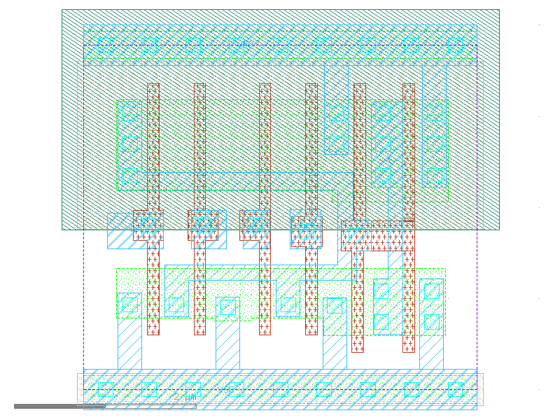

sg13g2_or4_2
============

4-input OR

-  **Cell name**: sg13g2_or4_2
-  **Type**: cell
-  **Verilog name**: sg13g2_or4_2
-  **Library**: sg13g2_stdcell
-  **Inputs**:  4 (A, B, C, D)
-  **Outputs**: 1 (X)

sg13g2_or4_2 schematic
----------------------

    sg13g2_or4_2 schematic

sg13g2_or4_2 GDSII layouts
---------------------------

    sg13g2_or4_2 layout
