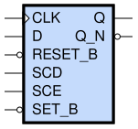

sg13g2_sdfbbp
=============

Posedge Two-Outputs D-Flip-Flop with Reset, Set and Scan

-  **Group name**: sg13g2_sdfbbp
-  **Type**: cell
-  **Library**: sg13g2_stdcell
-  **Inputs**:  6 (CLK, D, RESET_B, SCD, SCE, SET_B)
-  **Outputs**: 2 (Q, Q_N)

sg13g2_sdfbbp symbols
---------------------

    sg13g2_sdfbbp symbol

sg13g2_sdfbbp schematic
-----------------------

.. figure:: ../../../_static/schematics/sg13g2_sdfbbp_1.svg
    :align: center
    :width: 80%

    sg13g2_sdfbbp schematic

sg13g2_sdfbbp GDSII layouts
----------------------------

sg13g2_sdfbbp_1
~~~~~~~~~~~~~~~

-  **Area**: 63.504 µm²
-  **Pin Capacitance**:

   .. list-table::
      :widths: 50 50
      :header-rows: 1

      * - Pin
        - Capacitance (pF)
      * - CLK
        - 0
      * - D
        - 0
      * - Q
        - 0
      * - Q_N
        - 0
      * - RESET_B
        - 0
      * - SCD
        - 0
      * - SCE
        - 0
      * - SET_B
        - 0

.. figure:: ../../../_static/images/sg13g2_sdfbbp_1.png
    :align: center
    :width: 80%

    sg13g2_sdfbbp_1 layout
