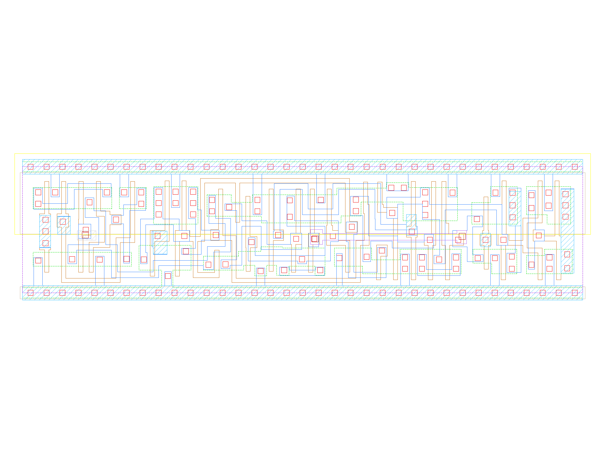

sg13g2_sdfbbp_1
===============

Posedge Two-Outputs D-Flip-Flop with Reset, Set and Scan

-  **Cell name**: sg13g2_sdfbbp_1
-  **Type**: cell
-  **Verilog name**: sg13g2_sdfbbp_1
-  **Library**: sg13g2_stdcell
-  **Inputs**:  6 (CLK, D, RESET_B, SCD, SCE, SET_B)
-  **Outputs**: 2 (Q, Q_N)

sg13g2_sdfbbp_1 schematic
-------------------------

.. figure:: ../../../_static/schematics/sg13g2_sdfbbp_1.svg
    :align: center
    :width: 80%

    sg13g2_sdfbbp_1 schematic

sg13g2_sdfbbp_1 GDSII layouts
------------------------------

    sg13g2_sdfbbp_1 layout
