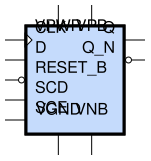

sg13g2_sdfrbp
=============

Posedge Two-Outputs Q and Q_N D-Flip-Flop with Reset and Scan

-  **Group name**: sg13g2_sdfrbp
-  **Type**: cell
-  **Library**: sg13g2_stdcell
-  **Inputs**:  5 (CLK, D, RESET_B, SCD, SCE)
-  **Outputs**: 2 (Q, Q_N)

sg13g2_sdfrbp symbols
---------------------

    sg13g2_sdfrbp symbol

sg13g2_sdfrbp schematic
-----------------------

.. figure:: ../../../_static/schematics/sg13g2_sdfrbp_1.svg
    :align: center
    :width: 80%

    sg13g2_sdfrbp schematic

sg13g2_sdfrbp GDSII layouts
----------------------------

sg13g2_sdfrbp_1
~~~~~~~~~~~~~~~

-  **Area**: 68.9472 µm²
-  **Pin Capacitance**:

   .. list-table::
      :widths: 50 50
      :header-rows: 1

      * - Pin
        - Capacitance (pF)
      * - CLK
        - 0
      * - D
        - 0
      * - Q
        - 0
      * - Q_N
        - 0
      * - RESET_B
        - 0
      * - SCD
        - 0
      * - SCE
        - 0

.. figure:: ../../../_static/images/sg13g2_sdfrbp_1.png
    :align: center
    :width: 80%

    sg13g2_sdfrbp_1 layout

sg13g2_sdfrbp_2
~~~~~~~~~~~~~~~

-  **Area**: 72.576 µm²
-  **Pin Capacitance**:

   .. list-table::
      :widths: 50 50
      :header-rows: 1

      * - Pin
        - Capacitance (pF)
      * - CLK
        - 0
      * - D
        - 0
      * - Q
        - 0
      * - Q_N
        - 0
      * - RESET_B
        - 0
      * - SCD
        - 0
      * - SCE
        - 0

.. figure:: ../../../_static/images/sg13g2_sdfrbp_2.png
    :align: center
    :width: 80%

    sg13g2_sdfrbp_2 layout
