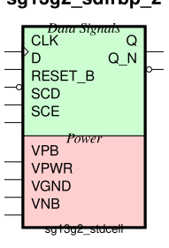
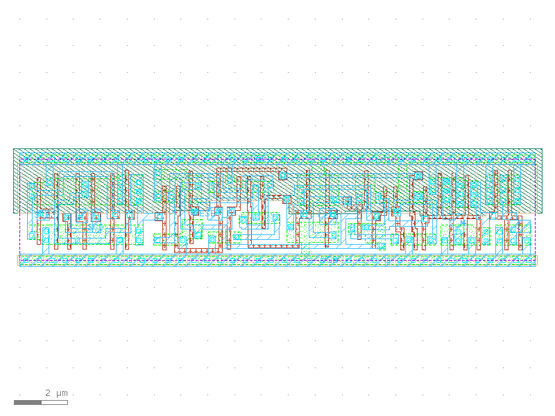

sg13g2_sdfrbp_2
===============

Posedge Two-Outputs Q and Q_N D-Flip-Flop with Reset and Scan

-  **Cell name**: sg13g2_sdfrbp_2
-  **Type**: cell
-  **Verilog name**: sg13g2_sdfrbp_2
-  **Library**: sg13g2_stdcell
-  **Inputs**:  5 (CLK, D, RESET_B, SCD, SCE)
-  **Outputs**: 2 (Q, Q_N)

Electrical and Physical Data
----------------------------

-  **Area**: 72.576 µm²
-  **Pin Capacitance**:

   .. list-table::
      :widths: 50 50
      :header-rows: 1

      * - Pin
        - Capacitance (pF)
      * - CLK
        - 0
      * - D
        - 0
      * - Q
        - 0
      * - Q_N
        - 0
      * - RESET_B
        - 0
      * - SCD
        - 0
      * - SCE
        - 0

sg13g2_sdfrbp_2 symbol
----------------------

    sg13g2_sdfrbp_2 symbol

sg13g2_sdfrbp_2 schematic
-------------------------

.. figure:: ../../../_static/schematics/sg13g2_sdfrbp_2.svg
    :align: center
    :width: 80%

    sg13g2_sdfrbp_2 schematic

sg13g2_sdfrbp_2 GDSII layouts
------------------------------

    sg13g2_sdfrbp_2 layout
