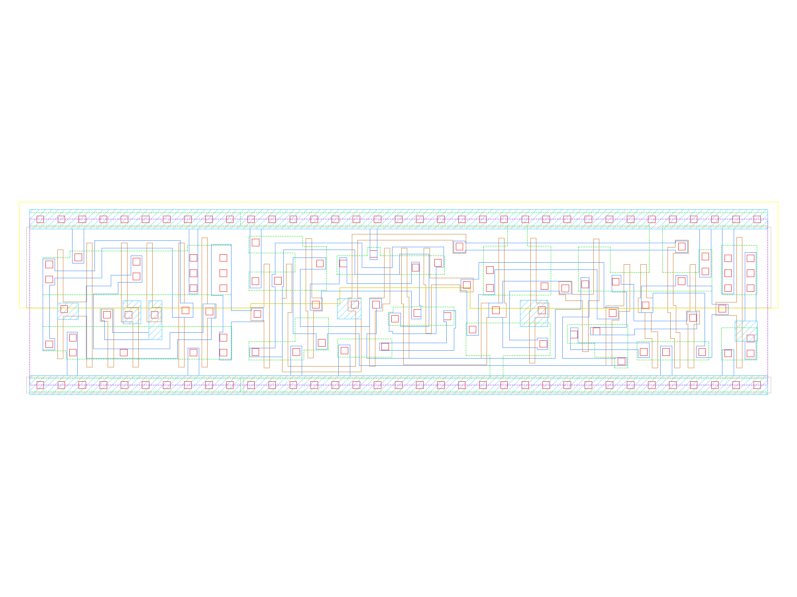

sg13g2_sdfrbpq_1
================

Posedge Single-Output Q D-Flip-Flop with Reset and Scan

-  **Cell name**: sg13g2_sdfrbpq_1
-  **Type**: cell
-  **Verilog name**: sg13g2_sdfrbpq_1
-  **Library**: sg13g2_stdcell
-  **Inputs**:  5 (CLK, D, RESET_B, SCD, SCE)
-  **Outputs**: 1 (Q)

sg13g2_sdfrbpq_1 schematic
--------------------------

.. figure:: ../../../_static/schematics/sg13g2_sdfrbpq_1.svg
    :align: center
    :width: 80%

    sg13g2_sdfrbpq_1 schematic

sg13g2_sdfrbpq_1 GDSII layouts
-------------------------------

    sg13g2_sdfrbpq_1 layout
