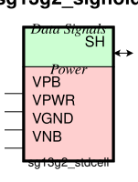
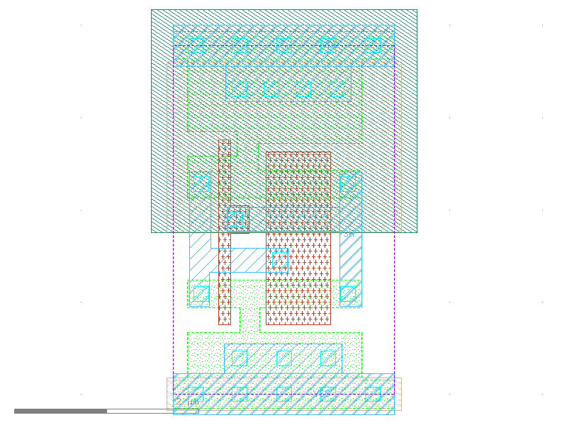

sg13g2_sighold
==============

Leakage current compensator (bus holder)

-  **Group name**: sg13g2_sighold
-  **Type**: cell
-  **Library**: sg13g2_stdcell
-  **Inputs**:  0 ()
-  **Outputs**: 0 ()

sg13g2_sighold symbols
----------------------

    sg13g2_sighold symbol

sg13g2_sighold schematic
------------------------

.. figure:: ../../../_static/schematics/sg13g2_sighold.svg
    :align: center
    :width: 80%

    sg13g2_sighold schematic

sg13g2_sighold GDSII layouts
-----------------------------

sg13g2_sighold
~~~~~~~~~~~~~~

-  **Area**: 9.072 µm²
-  **Pin Capacitance**:

   .. list-table::
      :widths: 50 50
      :header-rows: 1

      * - Pin
        - Capacitance (pF)
      * - SH
        - 0.0181867

    sg13g2_sighold layout
