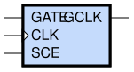
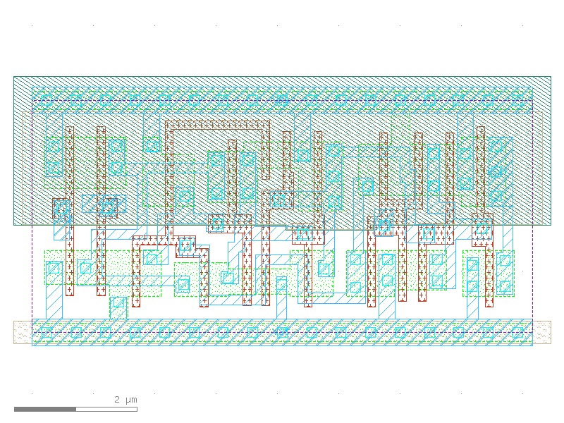

sg13g2_slgcp
============

Scan gated clock

-  **Group name**: sg13g2_slgcp
-  **Type**: cell
-  **Library**: sg13g2_stdcell
-  **Inputs**:  3 (GATE, CLK, SCE)
-  **Outputs**: 1 (GCLK)

sg13g2_slgcp symbols
--------------------

    sg13g2_slgcp symbol

sg13g2_slgcp schematic
----------------------

.. figure:: ../../../_static/schematics/sg13g2_slgcp_1.svg
    :align: center
    :width: 80%

    sg13g2_slgcp schematic

sg13g2_slgcp GDSII layouts
---------------------------

sg13g2_slgcp_1
~~~~~~~~~~~~~~

-  **Area**: 30.8448 µm²
-  **Pin Capacitance**:

   .. list-table::
      :widths: 50 50
      :header-rows: 1

      * - Pin
        - Capacitance (pF)
      * - CLK
        - 0.00497857
      * - GATE
        - 0.00193037
      * - GCLK
        - 0.001
      * - SCE
        - 0.00232746
      * - int_GATE
        - 0

    sg13g2_slgcp_1 layout
