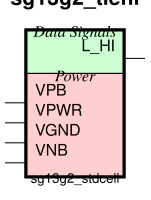

sg13g2_tiehi
============

Constant logic 0

-  **Group name**: sg13g2_tiehi
-  **Type**: cell
-  **Library**: sg13g2_stdcell
-  **Inputs**:  0 ()
-  **Outputs**: 1 (L_HI)

sg13g2_tiehi symbols
--------------------

    sg13g2_tiehi symbol

sg13g2_tiehi schematic
----------------------

.. figure:: ../../../_static/schematics/sg13g2_tiehi.svg
    :align: center
    :width: 80%

    sg13g2_tiehi schematic

sg13g2_tiehi GDSII layouts
---------------------------

sg13g2_tiehi
~~~~~~~~~~~~

-  **Area**: 7.2576 µm²
-  **Pin Capacitance**:

   .. list-table::
      :widths: 50 50
      :header-rows: 1

      * - Pin
        - Capacitance (pF)
      * - L_HI
        - 0

.. figure:: ../../../_static/images/sg13g2_tiehi.png
    :align: center
    :width: 80%

    sg13g2_tiehi layout
