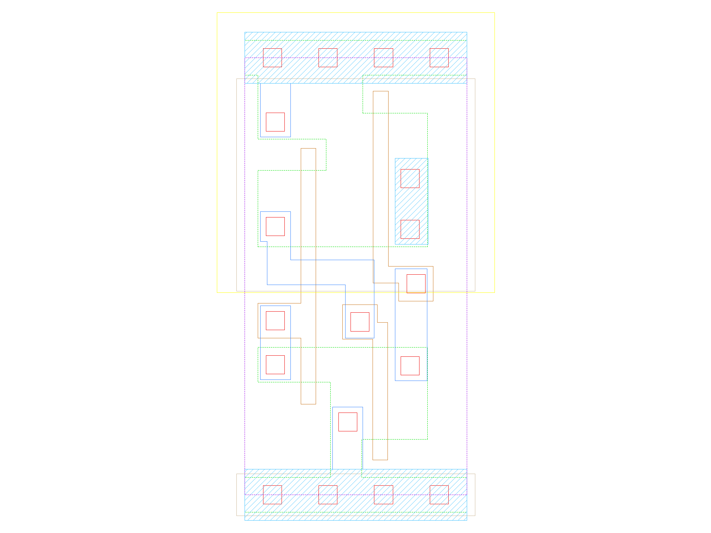

sg13g2_tiehi
============

Constant logic 0

-  **Cell name**: sg13g2_tiehi
-  **Type**: cell
-  **Verilog name**: sg13g2_tiehi
-  **Library**: sg13g2_stdcell
-  **Inputs**:  0 ()
-  **Outputs**: 1 (L_HI)

sg13g2_tiehi schematic
----------------------

    sg13g2_tiehi schematic

sg13g2_tiehi GDSII layouts
---------------------------

    sg13g2_tiehi layout
