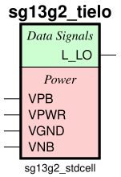

sg13g2_tielo
============

Constant logic 1

-  **Group name**: sg13g2_tielo
-  **Type**: cell
-  **Library**: sg13g2_stdcell
-  **Inputs**:  0 ()
-  **Outputs**: 1 (L_LO)

sg13g2_tielo symbols
--------------------

    sg13g2_tielo symbol

sg13g2_tielo schematic
----------------------

    sg13g2_tielo schematic

sg13g2_tielo GDSII layouts
---------------------------

sg13g2_tielo
~~~~~~~~~~~~

-  **Area**: 7.2576 µm²
-  **Pin Capacitance**:

   .. list-table::
      :widths: 50 50
      :header-rows: 1

      * - Pin
        - Capacitance (pF)
      * - L_LO
        - 0

.. figure:: ../../../_static/images/sg13g2_tielo.png
    :align: center
    :width: 80%

    sg13g2_tielo layout
