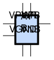
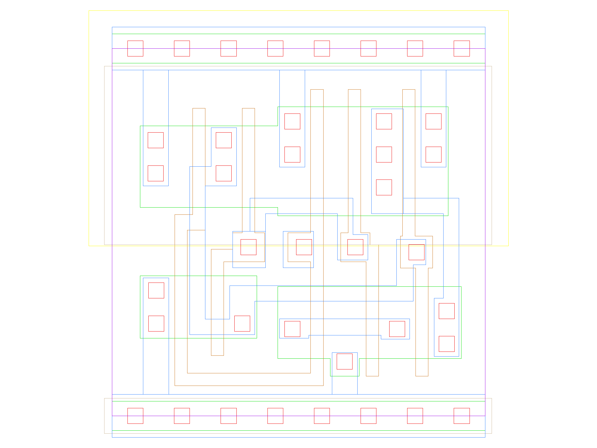

sg13g2_xnor2
============

2-input XNOR

-  **Group name**: sg13g2_xnor2
-  **Type**: cell
-  **Library**: sg13g2_stdcell
-  **Inputs**:  2 (A, B)
-  **Outputs**: 1 (Y)

sg13g2_xnor2 symbols
--------------------

    sg13g2_xnor2 symbol

sg13g2_xnor2 schematic
----------------------

    sg13g2_xnor2 schematic

sg13g2_xnor2 GDSII layouts
---------------------------

sg13g2_xnor2_1
~~~~~~~~~~~~~~

-  **Area**: 14.5152 µm²
-  **Pin Capacitance**:

   .. list-table::
      :widths: 50 50
      :header-rows: 1

      * - Pin
        - Capacitance (pF)
      * - A
        - 0.00562179
      * - B
        - 0.00508831
      * - Y
        - 0.001

    sg13g2_xnor2_1 layout
